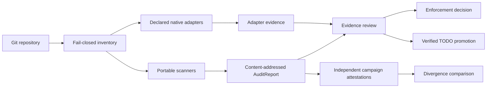

# RigorFoundry

[](https://github.com/anulum/RIGOR-FOUNDRY/actions/workflows/ci.yml)
[](https://github.com/anulum/RIGOR-FOUNDRY/actions/workflows/docs.yml)
[](LICENSE)
[](pyproject.toml)


Evidence-bound codebase transformation.

RigorFoundry inventories Git-tracked repository content, emits reproducible
audit candidates, binds review decisions to exact evidence, and prepares
remediation inputs without treating static heuristics as defect verdicts.

> **Current status:** standalone migration and verification. The repository has
> not been promoted as the GOTM fleet audit authority, published to PyPI, or
> released. A clean static scan is not a clean-repository claim.

## Operating contract

- `scan` is read-only and inspects only the exact Git-tracked inventory.
- Findings remain candidates until reviewed against the production surface.
- Missing evidence is explicit; it never resolves to pass.
- Reports bind repository HEAD, tree, tracked-content, policy, rule-pack, and
  exact Git executable/version provenance.
- Promotion rejects stale reports, stale policies, changed Git provenance,
  duplicate findings, and mismatched repositories.
- Native audit adapters use validated argv, bounded execution time, and
  `shell=False`.
- Internal campaign records are written only below Git-ignored paths.

## Architecture



The target profile model keeps five records separate:

1. `StandardPack` — versioned controls, licence, signature, and provenance.
2. `ProjectProfile` — selected controls, applicability, targets, and typed
   project variables.
3. `EffectiveProfileLock` — resolved inputs, digests, adapters, and
   contradiction evidence.
4. `ControlAssessment` — evidence-bound states such as `needs-evidence`,
   `blocked`, `fail`, `pass`, and `accepted-risk`.
5. `TargetGap` / `RemediationPlan` — the dependency-ordered difference between
   observed state and the declared target.

These records and their fail-closed resolver are implemented as a local typed
API. They do not grant execution authority, make RigorFoundry the fleet audit
authority, or prove effectiveness on an external corpus. See
[ARCHITECTURE.md](ARCHITECTURE.md).

## Quick start from source

```bash
git clone https://github.com/anulum/RIGOR-FOUNDRY.git
cd RIGOR-FOUNDRY
python3 -m venv .venv
.venv/bin/python -m pip install --require-hashes -r requirements/ci.txt
.venv/bin/python -m pip install --no-build-isolation --no-deps -e .
.venv/bin/rigor scan --root /path/to/repository
```

The GitHub repository is public, but RigorFoundry remains unreleased and is not
published to PyPI. There is no valid `pip install rigor-foundry` instruction
yet.

## Command surface

| Command | Contract |
| --- | --- |
| `rigor scan` | Emit a deterministic JSON or Markdown candidate report. |
| `rigor review-template` | Create explicit `needs-evidence` review records. |
| `rigor validate-review` | Verify reviews against one exact report. |
| `rigor promote` | Preview or append one current verified finding. |
| `rigor gate` | Apply observe, ratchet, or zero enforcement. |
| `rigor campaign-create` | Freeze an independent-audit input contract. |
| `rigor campaign-run` | Execute and attest one independent run. |
| `rigor campaign-compare` | Record disagreement and unresolved evidence. |

Declared native adapters run only after `--allow-native-audits` consent. They
execute in a no-network, read-only sandbox with a credential-free environment,
hard output and time bounds, process-tree termination, and structured durable
evidence. Native execution currently requires Bubblewrap at
`/usr/bin/bwrap` on a dpkg-based host, `/usr/bin/dpkg-query`, and a compatible
Bubblewrap 0.9.x installation. Passive scans and report review do not require
these native surfaces.

## Module ownership

| Surface | Modules | Responsibility |
| --- | --- | --- |
| Git trust | `git_provenance` | Fixed-root executable selection, supported versions, replacement detection, and content-addressed provenance. |
| Inventory | `git_inventory` | Exact tracked paths, content kinds, and digests through the trusted Git runner. |
| Candidate collection | `architecture`, `godfiles`, `polyglot_architecture`, `test_authenticity` | Static signals requiring review. |
| Policy and records | `rules`, `domains`, `audit_primitives`, `models` | Versioned rules, strict protocol primitives, applicability, and content-addressed records. |
| Review and enforcement | `review`, `enforcement` | Evidence validation, stale-state rejection, and controlled promotion. |
| Native boundaries | `adapters`, `sandbox_provenance`, `trusted_executable` | Descriptor-pinned, time/output-bounded repository commands plus versioned Bubblewrap compatibility and dpkg association. |
| Campaigns | `campaign_models`, `campaign_store`, `campaign_workflow`, `campaign_compare` | Independent-run provenance and divergence. |
| Profile primitives | `model_primitives`, `condition_language` | Typed variables, opaque secret references, strict values, and bounded conditions. |
| Desired state | `standard_pack`, `project_profile`, `effective_profile`, `profile_resolution`, `trust` | Versioned controls, explicit Ed25519 trust stores, adopter intent, exact pack locks, contradiction evidence, and fail-closed resolution. |
| Assessment and planning | `control_assessment`, `review_attestation`, `remediation_plan`, `_remediation_graph` | Signed fresh evidence, cryptographically verified reviewer separation, target gaps, adapter-bound procedures, and conflict-safe batches. |
| Work lifecycle | `internal_storage`, `work_models` | Ignored crash-safe storage and digest-bound task/event closure records. |

## Container use

```bash
docker build -t rigor-foundry:local .
docker run --rm --read-only \
  --mount type=bind,src=/path/to/repository,dst=/workspace,readonly \
  rigor-foundry:local scan --root /workspace
```

The container runs as a non-root user and contains Git because repository
inventory is a production dependency of the CLI.

## Verification and reproducibility

- Python support is declared only for 3.11, 3.12, and 3.13 and is represented
  in the CI matrix.
- CI dependencies are resolved into a hash-locked requirements file.
- Local work uses the repository-owned `.venv` on the GOTM working disk.
- GOTM authoring policy uses focused single-file tests locally; CI owns the
  exhaustive test and coverage gate. External contributors may opt into the
  same local matrix explicitly.
- Releases, when authorised after public-repository promotion, build wheel and
  source distributions, run metadata checks, generate a CycloneDX SBOM, create
  Sigstore signatures and provenance, and publish through an owner-gated OIDC
  environment.
- Benchmark and effectiveness claims require committed methodology and measured
  evidence. No such performance claim is made by the migration baseline.

See [VALIDATION.md](VALIDATION.md) for the gate matrix and
[SECURITY.md](SECURITY.md) for the threat boundary.

## Development

```bash
make install
make lint
make typecheck
make audit
make preflight-fast
```

Run focused test files with `pytest tests/test_name.py`. GOTM operators do not
run the local full suite unless the owner explicitly authorises it for the
current session; external contributors may opt in as documented in
`CONTRIBUTING.md`.
See [CONTRIBUTING.md](CONTRIBUTING.md).

## Community

- [Issue tracker](https://github.com/anulum/RIGOR-FOUNDRY/issues)
- [Discussions](https://github.com/anulum/RIGOR-FOUNDRY/discussions)
- [Support](SUPPORT.md)
- [Security reporting](SECURITY.md)

## Licence

RigorFoundry is available under the [Apache License 2.0](LICENSE). The licence
includes an explicit contribution-scoped patent grant; it does not grant rights
to use the RigorFoundry name or marks except as the licence permits.

---

<p align="center">
  <a href="https://www.anulum.li"></a>
  &nbsp;&nbsp;&nbsp;
  
  <br>
  <em>Developed by <a href="https://www.anulum.li">ANULUM</a> / Fortis Studio</em>
</p>
